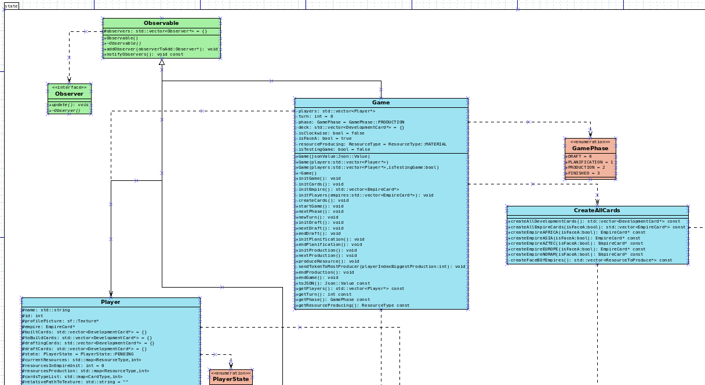
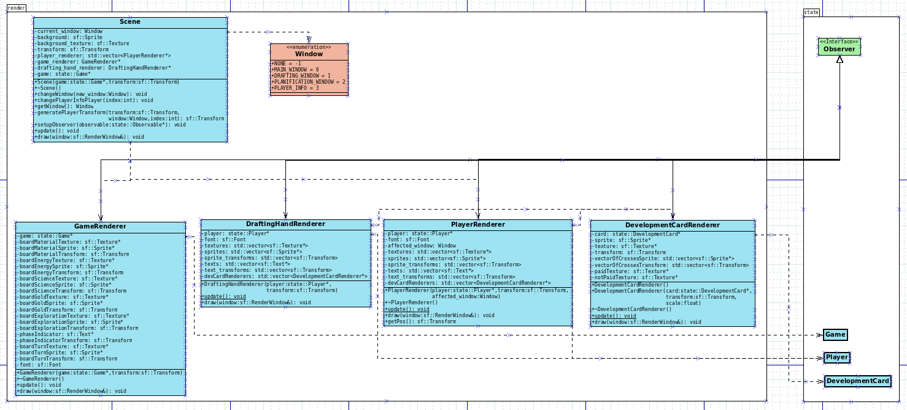

# Jalon 2.2 : Déroulement d'une partie de test

## Explication générale

Dans ce jalon, nous avons introduit la présence d'une partie de test qui dure un tour (au lieu de 4 lors d'une partie complète). Nous avons changé les différents états possibles du jeu, qui sont désormais au compte de 4 :

- Draft

- Planification

- Production

- Finished

Ajouter l'état Finished nous permet d'avoir un affichage particulier pour la fin de partie, et cela sera aussi utile par la suite pour l'implémentation de l'engine.

Pour passer d'un état à un autre, nous avons manuellement écrit les commandes des différents joueurs (Player), qui peuvent ainsi faire leurs actions avant d'appeler la méthodes de Game qui va elle faire appel aux différentes fonctions pour passer d'un état à un autre.

La commande suivante, appelée depuis le dossier principal :

```bash
./bin/client engine
```

Permet de lancer la partie de test. Afin de faire passer les différentes étapes, et donc la partie parmis ses différents états, il suffit d'appuyer sur la barre espace.

## Explication du fonctionnement des fichiers .dia

Afin de faire un affichage qui suive toujours l'état du jeu, nous avons décidé d'opter pour le **pattern design** de l'Observer / Observable.

Nos différents éléments de state sont observables (Game, Player et les Card). Voici donc un extrait du fichier state.dia correspondant :



Une fois les observables implémentés, il faut ajouter des observers à ces observables. Ces observers sont ce qui permettent d'afficher à l'écran la partie et se trouvent donc dans le render :



À chaque fois que l'on veut réaliser un changement dans le rendu visuel, il faut appeler la méthode 'notifyObservers' des observables. Dans chaque classe héritant de Observer, on implémente une version différente de update qui récupère les valeurs à jour de l'objet observé.

Cela permet d'avoir des modifications en temps réels, sans avoir pour autant à faire un raffraichissement tout les x secondes.
