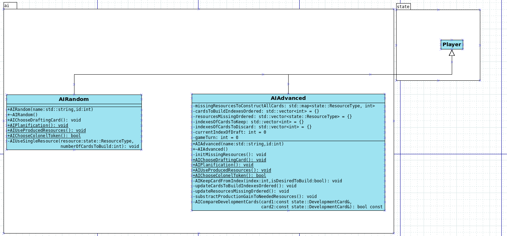
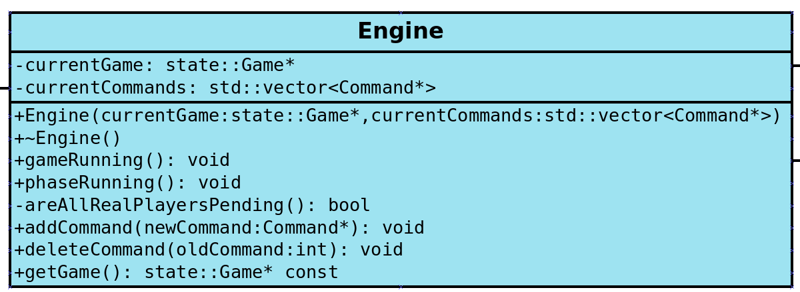
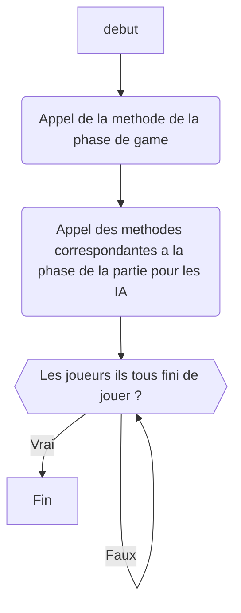

# Jalon 2.final et 3.1 : Intelligence artificielle

## Description des deux intelligences artificielles.

### Intelligence artificielle aléatoire

La première intelligence artificielle réalisée est complètement aléatoire. Voici son comportement durant les différentes phases de jeu :

- Draft : Pour chaque main qu'elle reçoit, elle prend aléatoirement une carte.

- Planification : Pour chaque carte qu'elle a récupérée, elle sélectionne aléatoirement (une chance sur deux) de garder la carte ou de la défausser. Une fois toutes les cartes traitées, elle utilise les différentes ressources à sa disposition.

- Production : Pour chaque étape de la production, elle itère sur toutes les ressources qu'elle possède, de manière aléatoire. Pour chaque ressource, elle tire un index au hasard, essaie de placer la ressource sur l'index correspondant. Si ce n'est pas possible, elle tente de le placer sur le suivant, puis le suivant etc. Si elle n'a pas réussi à placer sa ressource, elle la défausse.

Après de nombreux tests, nous avons pu voir que cette IA construit en moyenne moins d'une carte par partie et que son score moyen est de 0.5. Ces résultats sont faibles mais cohérents car elle joue complètement au hasard et n'a pas de logique de terminer une carte ou une autre en priorité.

## Intelligence artificielle heuristique

La deuxième intelligence artificielle réalisée possède une heuristique. Voici son comportement durant les différentes phases de jeu :

- Draft : Pendant le tour un, elle tente de prendre toutes les cartes qui rapportent des points sans pour autant nécessiter de condition de victoire. Si aucune carte ne respecte cette condition, elle tente de prendre une carte qui lui rapporte la ressource de défausse qui lui manque le plus. Pendant les autres tours, elle prend une carte à construire véritablement uniquement si elle en a moins de trois, sinon elle décide de s'axer sur les ressources de défausse.

- Planification : L'IA garde les cartes qu'elle souhaitait construire grâce aux points qu'elle peut apporter, et défausse les autres. Pour chaque carte défaussée, elle va jouer la ressource associée. La règle pour poser une ressource est de tenter de la poser sur la carte qui est la plus rapidement 'bientôt construite'.

- Production : Pour chaque ressource produite, elle pose ses ressources sur la carte la plus proche de la fin de construction, si ce n'est pas possible sur la suivante etc.

Après de nombreux tests, nous avons pu voir que cette IA construit en moyenne une à deux cartes par partie et que son score moyen est de 1.5. Ces résultats sont aussi très faibles mais il faut aussi bien se rendre compte que cette IA ne tente pas de créer des cartes qui l'aideront lors de la phase de production. Il est aussi important de noter que l'IA avancée gagne beaucoup plus souvent que l'IA aléatoire.

## Implémentation

Pour créer des IA, nous avons décider de les faire hériter de la classe Player, qui implémente 4 méthodes créées pour les IA :


Ces méthodes sont celles qui doivent être écrasées (override) par les IA afin de leur permettre de jouer les différents éléments de la partie. Voici le diagramme UML des IA :



Nous avons décidé de faire hériter les IA de player pour deux raisons principales :

- Cela simplifie le code dans la classe Game car il est possible d'itérer sur des pointeurs de Player de la même manière que pour des pointeurs d'IA. C'est notamment utile pour la phase de draft.

- De nombreuses fonctions sont communes et il serait inutile de les recoder (calcul des points, vérification de si une ressource peut être jouée, etc...)

## Engine : Faire tourner une partie

Afin de faire une partie, le Game s'occupe de passer entre les différents états via le state. Cependant, faire tourner une partie entière demande deux points en plus : exécuter les méthodes des IA, puis attendre que les vrais joueurs jouent. Nous avons donc créé l'engine qui permet de gérer cela :



Ce qui nous intéresse pour ce jalon sont uniquement les fonctions **gameRunning** et **phaseRunning**. Dans game running, on appelle la fonction **phaseRunning** tant que la partie ne s'est pas terminée. Dans la fonction **phaseRunning**, on appelle la méthode de Game correspondant à la phase en cours (selon si on est en phase de draft, de planification ou de production), puis on fait jouer les IA et enfin on attend que les joueurs aient tous finis de jouer. Une fois fait, on peut passer à l'étape suivante. Voici un diagramme de la fonction :



## Faire jouer des IA

Afin de réaliser une partie entre plusieurs intelligences artificielles, voici la commande à exécuter depuis le dossier principal :

La commande suivante, appelée depuis le dossier principal :

```bash
./bin/client AI x y
```

Ou **x** est le nombre de parties lancées et **y** (compris entre 2 et 5 inclus) le nombre d'IA dans la partie. Pour la répartition des IA, nous avons décidé que les IA impaires (1, 3 et 5) seront avancée et les IA paires seront aléatoire (2 et 4).Une fois la commande executée et terminée, des statistiques apparaitront à propos des différents résultats des IA.
